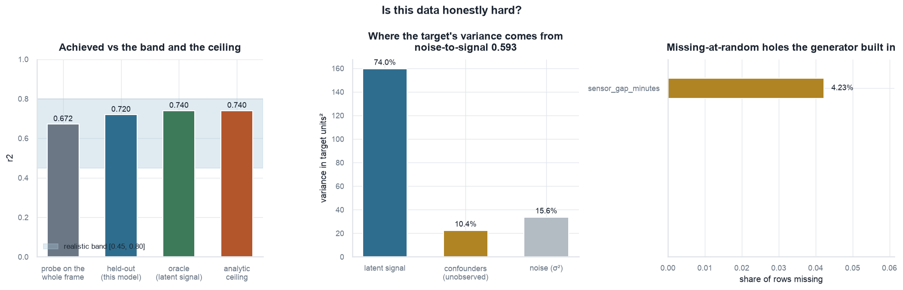
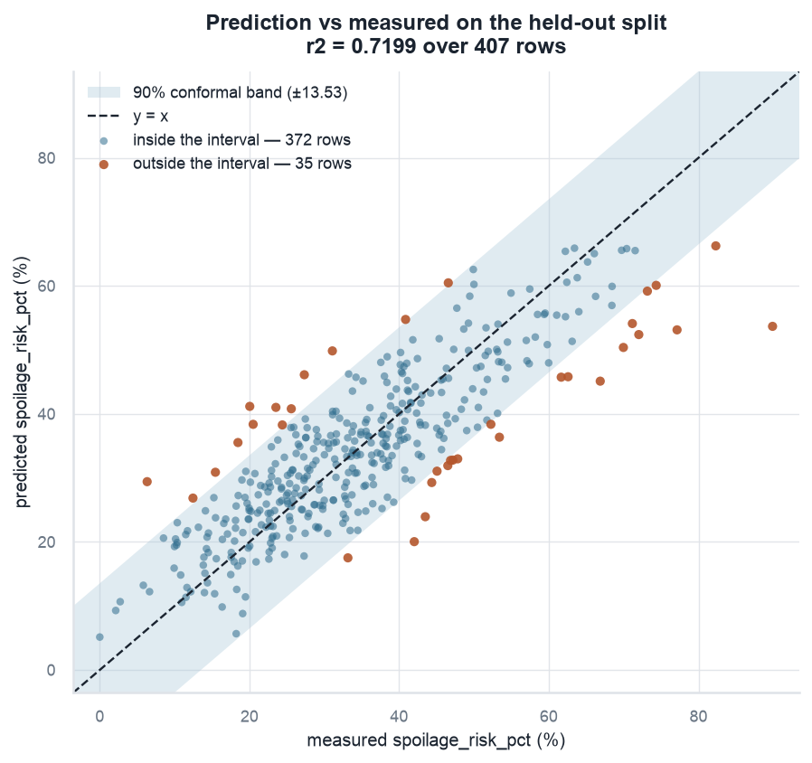
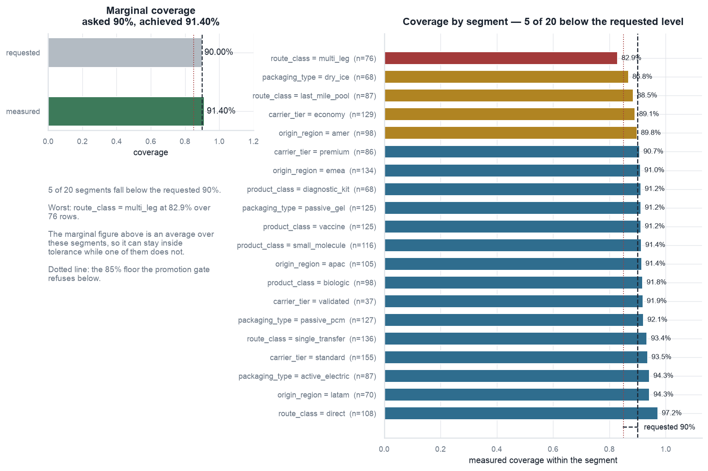
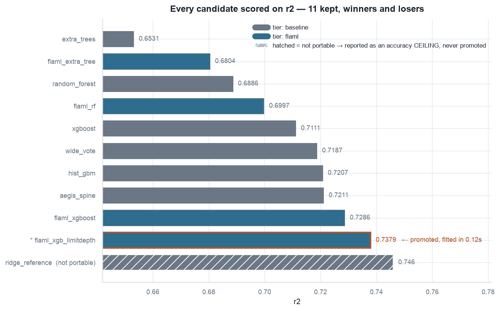
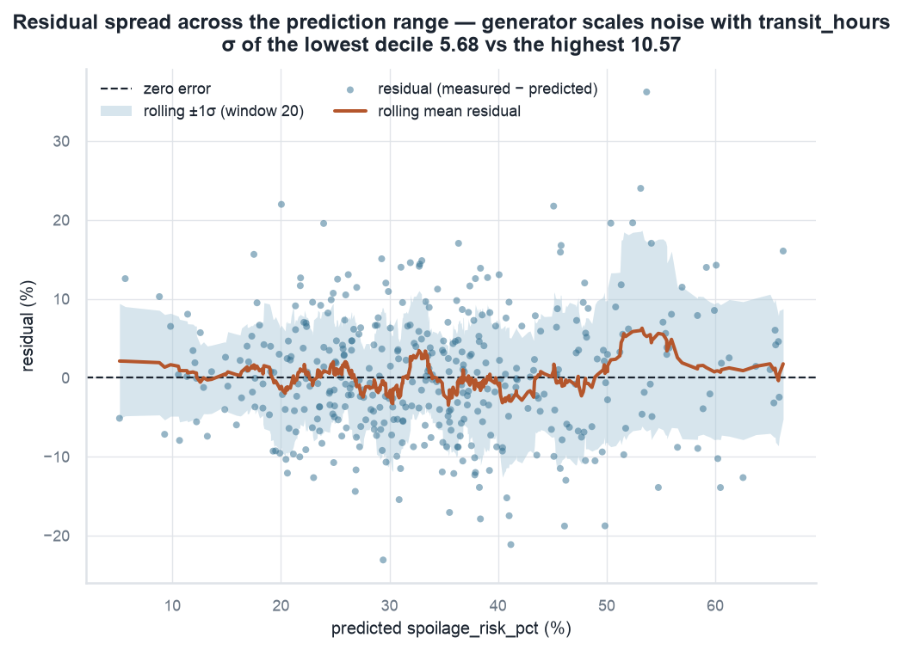
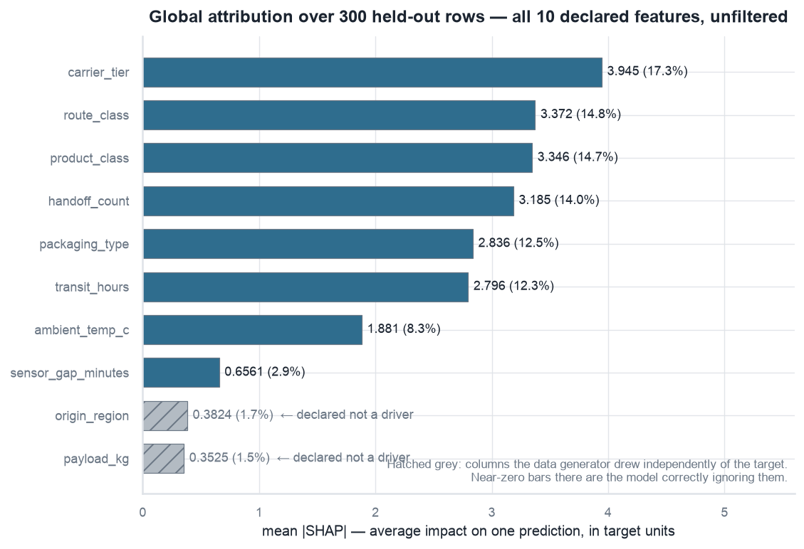
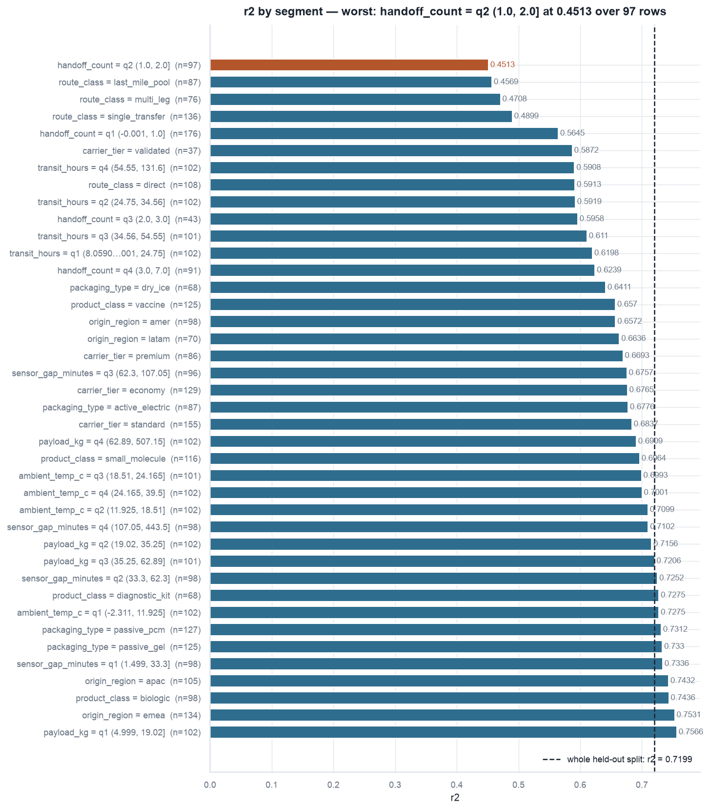
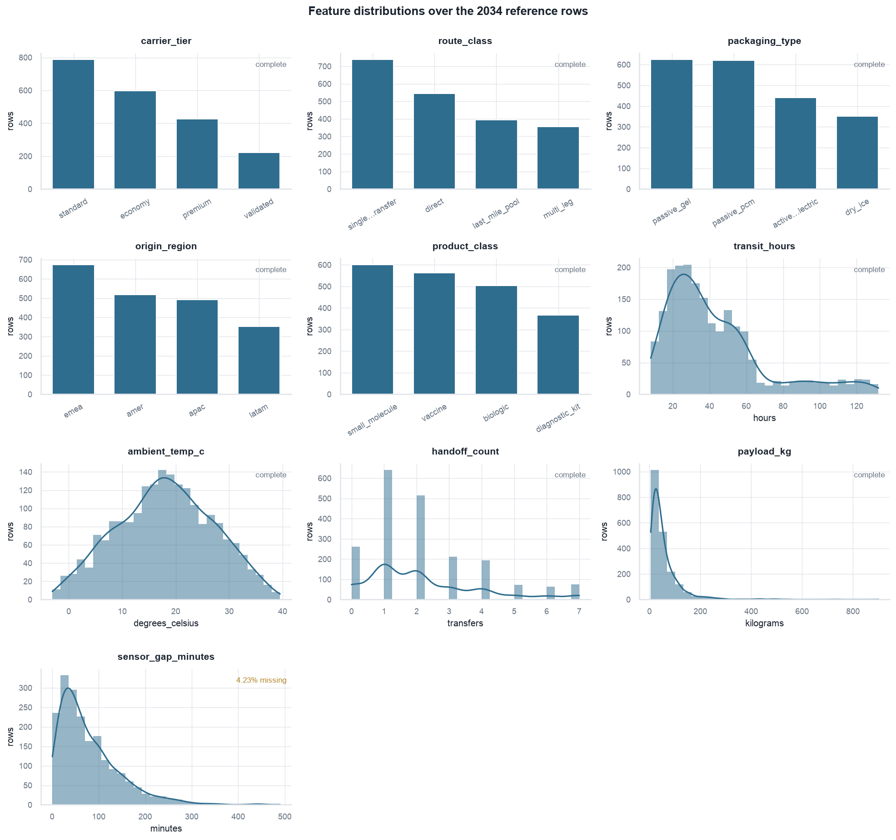
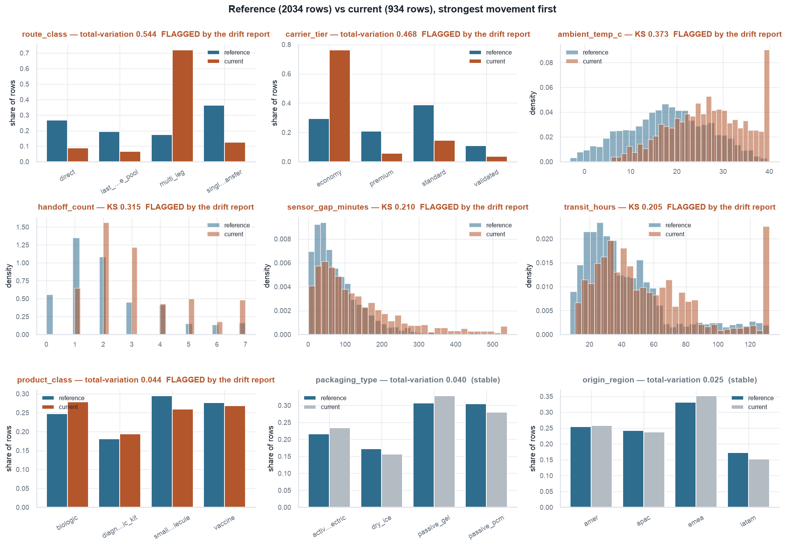
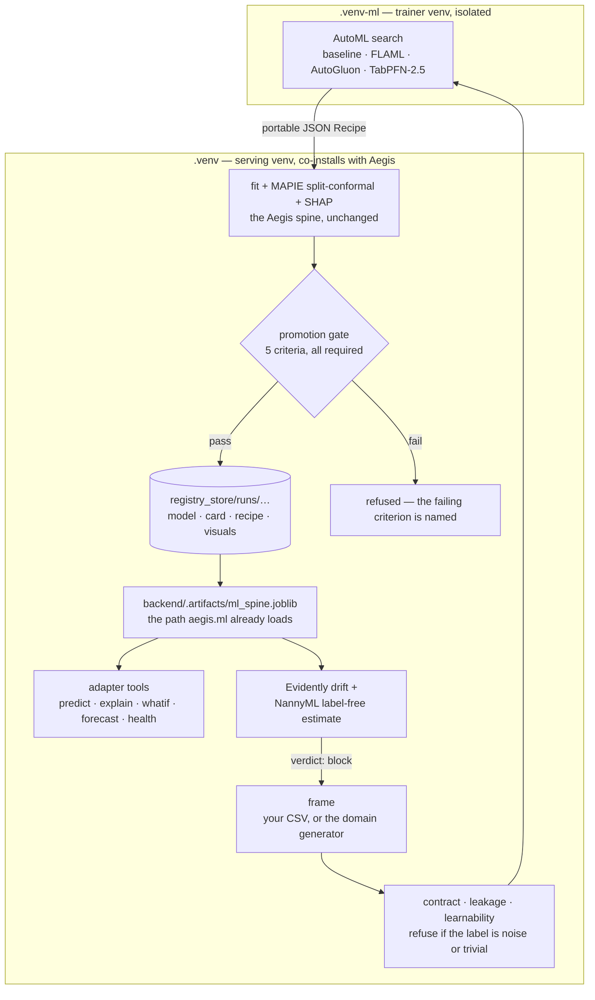

# aegis_ml


**The machine-learning half of an Aegis domain adapter** — AutoML search, data contracts, calibrated uncertainty, a model registry with a promotion gate, drift and label-free performance monitoring, per-run visuals — plus annotated adapter templates and a complete worked reference domain.

> New here? Start at [`docs/learn/00-index.md`](docs/learn/00-index.md). Already know Aegis? [`docs/00-START-HERE.md`](docs/00-START-HERE.md).

---

## Why it exists

Aegis already ships a serious ML spine: XGBoost + HistGradientBoosting soft-voting, **MAPIE split-conformal** intervals calibrated on a disjoint split, **SHAP TreeExplainer** attribution, a `ModelCard` that keeps *requested* and *empirical* coverage in separate fields, and SHA-256 dataset digests. That spine is good, and `aegis_ml` **never replaces it**.

What it extends: AutoML across four tiers, generated data contracts, a filesystem registry with a five-criterion promotion gate, drift plus label-free performance estimation, a visual report per run, and templates for all ten adapter pieces. The AutoML search runs in an isolated trainer venv and hands its answer back as a **portable JSON `Recipe`** — the Aegis spine then fits that recipe, so conformal calibration, SHAP, the card and the digest all survive intact and nothing inside `aegis/` changes.

---

## What a run produces

Every figure below is a real chart from one real run — `cold_chain_logistics-20260824T030131425-34e3f5`, produced by `scripts/run_demo.py` on the worked reference domain. The same nine PNGs, plus a self-contained `index.html`, are written to `registry_store/runs/<run_id>/visuals/` for every registered run. Numbers in the captions are read off the charts and off that run's artifacts.

### Is the data honestly hard?



**Look at the gap on the left.** The held-out model scores **0.720**, the oracle that knows the generating function scores **0.740**, and the analytic ceiling is **0.740** — so the model sits just under a ceiling that physically exists, and *inside* the declared realistic band [0.45, 0.80] rather than above it. (The grey bar is the cheap learnability probe run over the whole frame before anything expensive: 0.672, which is 90.8% of the oracle.) The middle panel says why the ceiling is where it is: 74.0% of the target's variance is latent signal, 10.4% is unobserved confounders, 15.6% is irreducible noise (noise-to-signal **0.593**). The right panel shows the 4.23% missing-at-random holes the generator deliberately punched in `sensor_gap_minutes`. A fixture that scores R² 0.99 is not a good result — it is a tell that the label is a closed-form function of the inputs, and this panel exists to make that visible in one glance.

### Does the conformal interval mean what it says?



**Count the orange dots.** 407 held-out rows, a 90% band of half-width **±13.53** (the 0.9049 quantile of 326 disjoint calibration residuals), **372 inside** and **35 outside** — an empirical coverage of 91.4% against the 90% requested. The band is wide because the data is genuinely noisy; that is the honest width, not a defect.



**The marginal number hides the failures.** 91.40% achieved against 90% requested looks fine — but the right panel breaks it down and **5 of 20 segments fall below the requested level**, the worst being `route_class = multi_leg` at **82.9%** over 76 rows. Conformal guarantees are marginal by construction, so this chart is the one that tells you which customers get a band that under-delivers. The dotted line is the 85% floor the promotion gate refuses below.

### Which model won, and which one only looks like it won?



**The top bar is hatched, and that is the point.** `ridge_reference` scored the highest r² on this split (**0.746**) but is not portable — a linear model refits fine, yet the Aegis spine explains its ensemble with `shap.TreeExplainer`, which supports tree models only, so promoting it would train, score, and then raise on the first request that asks *why*. It is reported as an **accuracy ceiling** and never promoted. The promoted model is `flaml_xgb_limitdepth` at **0.7379**, fitted in 0.12 s, beating the Aegis spine's own baseline (0.7211) by +0.017. An unavailable estimator and an estimator that lost on merit must never look the same on a leaderboard.

<details>
<summary><b>The other five figures</b> — residuals, SHAP, slices, distributions, drift</summary>

### Residuals



The fan is deliberate: the generator scales noise with `transit_hours`, and the title quantifies it — residual σ of **5.68** in the lowest prediction decile against **10.57** in the highest. (The generator's declared spread is 1.48× between the top and bottom `transit_hours` quartiles.) The rolling mean stays on zero, so the model is unbiased; only its precision degrades with journey length.

### Global attribution



All **10 declared features** over 300 held-out rows, unfiltered. `carrier_tier` leads at **3.945** (17.3% of total attribution). The two hatched bars — `origin_region` at 1.7% and `payload_kg` at 1.5% — are columns the generator drew *independently of the target*; they are annotated "declared not a driver", and their near-zero attribution is the model correctly ignoring them. Deleting irrelevant features before plotting would hide exactly the evidence worth having.

### Per-segment performance



The dashed line is the whole held-out split at r² 0.7199. The worst segment is `handoff_count = q2 (1.0, 2.0]` at **0.4513** over 97 rows. Because no champion existed, this number becomes the floor every later challenger must hold — the gate's `worst_slice_not_worse` criterion checks it, so a challenger cannot win on average by getting worse where it already hurts.

### Feature distributions



All ten features over the 2,034 frozen reference rows, each panel labelled `complete` or with its missing share — `sensor_gap_minutes` at 4.23%. This is the frame drift is later measured against, so it is worth being able to see it.

### Drift



Reference (2,034 rows) against a current frame (934 rows) shifted the way this domain actually degrades — a hot season, volume moved onto cheaper multi-leg lanes, telemetry cadence worsening with it. Strongest movement first: `route_class` total-variation **0.544**, `carrier_tier` **0.468**, `ambient_temp_c` KS **0.373**. Seven of ten features flagged (70%), verdict **`block`**; `packaging_type` and `origin_region` are correctly left alone as stable.

</details>

---

## Verified results

Everything in this table was **measured by running the code**, not asserted. Sources are named so you can re-run any row.

| Claim | Measured | Source |
|---|---|---|
| Test suite | **314 tests, 0 failed, 0 xfail.** In a bare checkout: 311 passed + 3 skipped in 4 min; the 3 skips are the `DomainAdapter` Protocol checks, and they pass once the Aegis source is on `PYTHONPATH` — **314 passed** | `.venv/bin/python -m pytest tests -q` |
| Aegis conformance, reference domain | **14 passed / 14** — `pytest --pyargs aegis.conformance --aegis-adapter reference.adapter` | [`ISSUES.md`](ISSUES.md) |
| `aegis-ml doctor` | exits **0** in both venvs | [`ISSUES.md`](ISSUES.md) |
| `ruff check src` | **0 errors** across 59 modules | [`ISSUES.md`](ISSUES.md) |
| Every module imports | **52 / 52** | [`ISSUES.md`](ISSUES.md) |
| No mocks, stubs or empty bodies in `src/` | PASS, 14 reviewed opt-outs | `scripts/audit_no_mocks.py` |
| End-to-end run — accuracy | r² **0.7199** on 407 held-out rows (splits 1301 / 326 / 407) | [`registry_store/RUN_SUMMARY.md`](registry_store/RUN_SUMMARY.md) |
| End-to-end run — coverage | requested 90%, **empirical 91.4%** | same run |
| End-to-end run — gate | **5 / 5** criteria passed, artifact promoted | same run |
| End-to-end run — drift | 70% of features drifted → verdict **`block`**, correct columns named | same run |
| An earlier end-to-end run | r² **0.6391** on 280 held-out rows, coverage **93.57%** vs 90% requested, gate 5/5, drift → `block`, 13 artifacts | [`ISSUES.md`](ISSUES.md) |
| Data realism | R² 0.656 / 0.588 / 0.6391 and accuracy 0.743 — inside the 0.45–0.80 band, never above it | [`ISSUES.md`](ISSUES.md) |
| Learnability guards | pure-noise target → `LabelNotLearnableError`; deterministic target → R² 0.994 flagged `suspiciously_easy` | [`ISSUES.md`](ISSUES.md) |
| AutoGluon tier | R² **0.5411**, 10 models, 20 s | [`ISSUES.md`](ISSUES.md) |
| Evidently drift | stable frame → 0.000 drifted share, `pass`; shifted → 0.429, `block` | [`ISSUES.md`](ISSUES.md) |
| NannyML, no labels at all | `estimated_rmse = 2.07 [1.71, 2.44]` | [`ISSUES.md`](ISSUES.md) |
| Optuna HPO | r² 0.6158 → **0.6556** in 12 trials; SQLite study resumes | [`ISSUES.md`](ISSUES.md) |
| Held-out split provenance | recovered and verified — re-scoring the persisted model reproduces the registered r² = 0.722406014223 exactly; a wrong seed gives 0.7805 and is **rejected** | [`ISSUES.md`](ISSUES.md) |
| Both dependency tiers resolve | serving lock 153 packages, trainer lock 1,174; `pandas` / `numpy` / `sklearn` byte-identical across both (2.3.3 / 2.4.6 / 1.9.0) | [`RESOLUTION.md`](RESOLUTION.md) |
| Per-run visuals | 9 PNGs + `index.html` (0 external references) + `interactive.html`, written automatically | [`ISSUES.md`](ISSUES.md) |

---

## Quickstart

### Install — two virtualenvs, deliberately

The Aegis backend carries hard caps (`pandas>=2.2,<2.4`, `numpy>=1.26,<2.5`, `numba==0.67.0`) that AutoGluon, TabPFN-2.5 and torch will not resolve under. So: install everything, isolate the heavy half.

```bash
cd /Users/yrevash/aegis_ml

# 1 — serving venv: everything that co-installs with Aegis (Makefile: make install)
uv venv .venv --python 3.11
uv pip install --python .venv -e '.[dev]'

# 2 — trainer venv: AutoGluon + TabPFN + torch + SDV, isolated (Makefile: make install-strong)
uv venv .venv-ml --python 3.11
uv pip install --python .venv-ml -e '.[strong,serve]'

# 3 — optional: the serving tier into the Aegis backend venv
uv pip install --python /path/to/aegis/backend/.venv -e '/Users/yrevash/aegis_ml[serve]'
```

<details>
<summary>Windows PowerShell</summary>

```powershell
Set-Location C:\aegis_ml

uv venv .venv --python 3.11
uv pip install --python .venv -e ".[dev]"

uv venv .venv-ml --python 3.11
uv pip install --python .venv-ml torch --index-url https://download.pytorch.org/whl/cpu
uv pip install --python .venv-ml -e ".[strong,serve]"

uv pip install --python C:\aegis\backend\.venv -e "C:\aegis_ml[serve]"
```

Install torch from the CPU index **first**, so AutoGluon resolves against it. `autogluon.tabular` and `autogluon.timeseries` install on Windows; `autogluon.multimodal` does not. Full detail in [`docs/08-windows.md`](docs/08-windows.md).
</details>

The trainer venv is **skippable**. `baseline` and `flaml` run in the serving venv and produce a portable recipe on their own; the strong tiers then report themselves unavailable *with a reason*, which costs a leaderboard row rather than the demo.

### Check the environment, then run the whole thing

```bash
.venv/bin/aegis-ml doctor          # environment, tiers, paths, realism band — exits 0 when ready
.venv/bin/python scripts/run_demo.py
```

```powershell
.venv\Scripts\aegis-ml.exe doctor
.venv\Scripts\python.exe scripts\run_demo.py
```

`doctor` prints the resolved versions, which AutoML tiers will actually run (and *why* the others will not), where the promoted artifact goes, and whether the reference frame's held-out score sits inside the realism band. `run_demo.py` then generates a synthetic pharmaceutical cold-chain world, admits it through the data contract, proves the label is learnable *and not too easy*, searches, tunes, fits, calibrates, judges at the gate, and deliberately breaks the world to measure drift. A stage that fails takes the script down with a non-zero exit code — no stage fabricates a number when it cannot run.

### Where the artifacts land

```
registry_store/
├── RUN_SUMMARY.md                      the whole run in one readable file
├── index.json                          the run index
├── reports/                            profile + drift HTML
└── runs/<run_id>/
    ├── model.joblib  recipe.json  leaderboard.json  metrics.json  entry.json
    ├── card.md  card.html  shap.html  profile.html
    ├── reference.parquet  current.parquet  split.json  drift.json
    └── visuals/  01…09 PNG · index.html · interactive.html · manifest.json
```

Open the visual report:

```bash
open   registry_store/runs/<run_id>/visuals/index.html    # macOS
xdg-open registry_store/runs/<run_id>/visuals/index.html  # Linux
```

```powershell
Start-Process registry_store\runs\<run_id>\visuals\index.html
```

`index.html` is self-contained — every image is inlined, zero external references — so it opens from a file path, over a share, or inside a sandbox with no network. To rebuild it for any registered run: `.venv/bin/aegis-ml visuals --run-id <run_id> --open`.

### The CLI

```
doctor · init · contract · synth · train · eval · promote · rollback
drift · forecast · card · export · visuals · registry · serve
```

```bash
.venv/bin/aegis-ml contract --data path/to/frame.parquet   # pandera + learnability + leakage, seconds
.venv/bin/aegis-ml train --tier baseline --tier flaml --full
.venv/bin/aegis-ml promote --run-id <run_id>               # the five-criterion gate
.venv/bin/aegis-ml drift --run-id <run_id> --data current.parquet
.venv/bin/aegis-ml registry                                # runs newest first, both coverage numbers
```

Add `--trainer-venv` to `train` to run the search inside `.venv-ml` as a subprocess and bring back the portable recipe. Every command's flags: `aegis-ml <command> --help`.

---

## What's in the box

| Subpackage | What it does |
|---|---|
| `contracts/` | The pydantic-only type layer — `MLProblem`, frames, protocols, nine typed errors. Imports **nothing but pydantic**, with a test asserting it in a subprocess |
| `data/` | SDV synthesis, the latent-model realism engine, three-way splits, skrub profiling, contract validation |
| `features/` | skrub `TableVectorizer` pipeline and the leakage audit |
| `automl/` | Four tiers (baseline · FLAML · AutoGluon · TabPFN-2.5), Optuna HPO, the portable `Recipe`, and the subprocess bridge into the trainer venv |
| `evaluate/` | Metrics, cross-validation, conformal calibration, the slice sweep, and the five-criterion promotion `gate` |
| `explain/` | SHAP report, partial dependence, reason codes, and the model card |
| `registry/` | Filesystem-first run store, atomic promotion with rollback, optional MLflow mirror, optional SQLAlchemy tables |
| `monitor/` | Prediction log, Evidently drift, NannyML label-free performance estimation, alert routing |
| `report/` | The per-run visual bundle: one palette, nine figures, and the self-contained `index.html` |
| `forecast/` | Wraps `aegis.forecast` (StatsForecast + `ConformalIntervals`), plus mlforecast and foundation models, with rolling-origin backtests |
| `serve/` | The FastAPI router and the five ML `ToolSpec`s that drop into an adapter's tool registry |
| `pipelines/` | `data_flow` · `train_flow` · `promote_flow` · `drift_flow` as plain functions, with Prefect applied as a decorator only when it imports |
| `export/` | ONNX export with a validated round-trip — off by default, see Limitations |

Alongside the package: [`templates/adapter/`](templates/adapter/) (the ten adapter pieces as annotated skeletons), [`reference/`](reference/README.md) (a complete worked domain — pharmaceutical cold-chain logistics, green end to end), [`prompts/`](prompts/) (authoring packs, one per piece), and [`config/`](config/) (five TOML files: automl, forecast, monitoring, pipeline, contracts).

---

## Architecture in one diagram



---

## The two design decisions worth knowing

**D1 — two virtualenvs, one portable recipe.** This is the keystone. AutoGluon 1.6, TabPFN-2.5 and torch will not resolve inside the Aegis backend venv, and installing them there is the single most likely way to lose a morning. So the heavy half lives in `.venv-ml` and the bridge between the two is data, not code: the search returns a JSON `Recipe` — an explicit allowlist of tree learners that `shap.TreeExplainer` supports — and `automl.recipe.to_aegis_members()` turns it into exactly the `list[tuple[str, Estimator]]` shape the Aegis spine already builds. Full AutoML benefit, zero changes inside `aegis/`. Portability is decided by *fitting* a two-row probe, not by checking importability, because that is the question that actually matters — which is how LightGBM's broken sklearn wrapper got caught after it had already killed a FLAML tier mid-search.

**D2 — ML reaches the agent through tools, not the graph.** `aegis_ml.serve.tools` ships five ready-made `ToolSpec`s — `predict_outcome`, `explain_prediction`, `whatif_scenario`, `forecast_series`, `check_model_health` — that drop straight into an adapter's `TOOL_REGISTRY`. Every answer carries its conformal interval and its top SHAP drivers. No `graph.py` edit is needed, and the platform's rule holds unchanged: **ML informs, it never gates** — the human approval gate fires on a tool's risk tier, and all five ML tools are read-only and LOW. In the reference domain this yields 9 registered tools: 4 domain actions plus these 5.

Rationale, alternatives and sources: [`docs/10-architecture-decisions.md`](docs/10-architecture-decisions.md) and [`finalplan.md`](finalplan.md).

---

## Honest limitations

Full list, with reproductions: [`ISSUES.md`](ISSUES.md) — **10 of 16 fixed**; of the six open, one is an accepted limitation, one is a one-time action for the operator, and four are defects in Aegis's own repo recorded so they are not inherited by accident.

**TabPFN-2.5 is licence-gated.** The weights are distributed under the Prior Labs License: **research and evaluation use are permitted; commercial and production use are not.** The tier also needs a one-time, browser-based setup — register at [ux.priorlabs.ai](https://ux.priorlabs.ai), accept the licence, copy the API key, `export TABPFN_TOKEN=…`, and run one fit to cache the weights. Do that before you need it: without it `pip install tabpfn` succeeds, `import tabpfn` succeeds, and `.fit()` raises `TabPFNLicenseError` *inside the search*, after earlier tiers have spent their budget. `aegis-ml doctor` now probes for this and reports it as a skipped tier with the remedy instead of crashing. Skip it entirely with `AEGIS_ML_ENABLE_TABPFN=0`; AutoGluon covers the same ground. When it does run, its score is reported as an accuracy **ceiling** and never promoted as the serving model.

**ONNX export is off by default** (`export_onnx = false` in `config/pipeline.toml`), for two measured reasons. Learned NaN routing does not survive conversion — the same RandomForest measured `2.4e-06` max absolute difference on complete rows and **17.7** on rows containing NaNs, and this data deliberately carries ~4% missingness. And `HistGradientBoosting` will not convert at all on skl2onnx 1.20 (`TypeError` inside the TreeEnsemble attributes; `to_onnx` catches and re-raises with context). Nothing in Aegis serves ONNX today, so this is a documented limitation rather than a blocker — but if you turn it on, the NaN behaviour must be surfaced on the model card.

**LightGBM's sklearn wrapper is unusable in this stack**, and deliberately so. `nannyml` pins `lightgbm<4.6`, and `lightgbm<4.6`'s wrapper passes `check_X_y(force_all_finite=)`, removed in scikit-learn 1.8. NannyML, FLAML and AutoGluon all drive LightGBM through its native API and are unaffected; only a direct `LGBMRegressor(...).fit(...)` raises. The trade — drop NannyML to raise the pin — is not worth taking: label-free performance estimation is the harder capability to replace. Full analysis in [`RESOLUTION.md`](RESOLUTION.md).

---

## Documentation

**Beginners:** [`docs/learn/00-index.md`](docs/learn/00-index.md) — the guided track, from zero.

**Reference:**

| | |
|---|---|
| [`docs/00-START-HERE.md`](docs/00-START-HERE.md) | Two-minute orientation, reading order, first three commands |
| [`docs/01-what-is-aegis.md`](docs/01-what-is-aegis.md) | The platform — and what it already gives you free, so you do not rebuild it |
| [`docs/02-domain-adapter-contract.md`](docs/02-domain-adapter-contract.md) | The Protocol in full, the 14 conformance checks by name, the host-bound symbols |
| [`docs/03-authoring-a-domain.md`](docs/03-authoring-a-domain.md) | Problem statement → ten filled pieces, in the right order |
| [`docs/04-synthetic-data.md`](docs/04-synthetic-data.md) | Latent models, calibrated noise, and why R² 0.99 is a failure |
| [`docs/05-ml-pipelines.md`](docs/05-ml-pipelines.md) | Flows, AutoML tiers, HPO, the portable recipe, reading the outputs |
| [`docs/06-mlops-registry-drift.md`](docs/06-mlops-registry-drift.md) | Registry, champion/challenger, the five-criterion gate, rollback, drift |
| [`docs/07-integration-with-aegis.md`](docs/07-integration-with-aegis.md) | The day-of procedure, with exact commands |
| [`docs/08-windows.md`](docs/08-windows.md) | Two venvs on Windows, PowerShell throughout, no Docker or WSL |
| [`docs/09-troubleshooting.md`](docs/09-troubleshooting.md) | Symptom → cause → fix. If it did not raise, it is in here |
| [`docs/10-architecture-decisions.md`](docs/10-architecture-decisions.md) | D1–D6 as ADRs, the tool choices, the risk register, the sources |

**Also worth reading:** [`finalplan.md`](finalplan.md) (the plan and its research appendix) · [`RESOLUTION.md`](RESOLUTION.md) (how both dependency tiers were resolved, and what was learned by running the resolver) · [`ISSUES.md`](ISSUES.md) (every known defect, with its reproduction) · [`reference/README.md`](reference/README.md) (the worked domain) · [`prompts/CHECKLIST.md`](prompts/CHECKLIST.md).

---

## Attribution

`aegis_ml` extends the Aegis agentic-AI platform and depends on its `aegis.ml` and `aegis.forecast` modules; it does not vendor or fork them.

Built on scikit-learn, XGBoost, MAPIE, SHAP, pandera, skrub, Optuna, FLAML, Evidently, NannyML, AutoGluon, TabPFN-2.5, SDV, StatsForecast, matplotlib, seaborn and plotly — each under its own licence. **TabPFN-2.5 weights are Prior Labs License: research and evaluation only** (see Limitations above).
