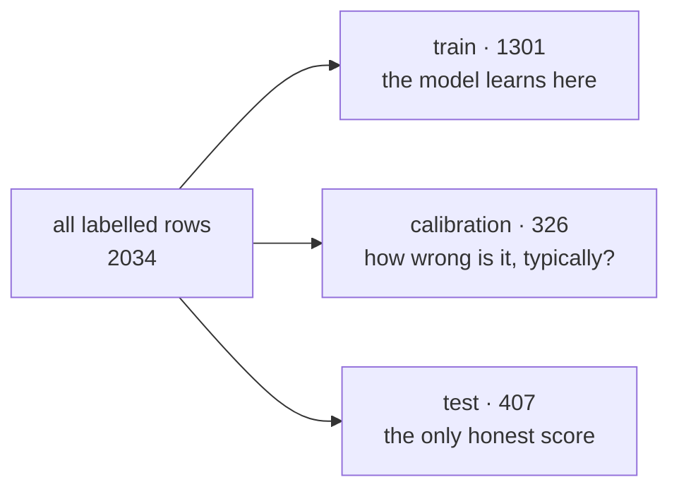

# 02 · The ML concepts you need

[← 01](01-what-problem-does-this-solve.md) · [Index](00-index.md) · Next: [03 · The data problem](03-the-data-problem.md)

Everything in this chapter uses the same running example: the cold-chain domain in
[`reference/`](../../reference/README.md), which predicts what percentage of a
pharmaceutical shipment will be spoiled on arrival.

---

## 1. Features, target, labels

A **table** of data. Each row is one thing that happened — here, one shipment. Each column
is one fact about it.

| carrier_tier | route_class | transit_hours | ambient_temp_c | … | **spoilage_risk_pct** |
|---|---|---|---|---|---|
| standard | multi_leg | 41.2 | 27.4 | … | **38.6** |
| premium | direct | 12.0 | 9.1 | … | **11.2** |

* The columns you get to *look at* are **features**. This domain declares ten of them:
  `carrier_tier`, `route_class`, `packaging_type`, `origin_region`, `product_class`,
  `transit_hours`, `ambient_temp_c`, `handoff_count`, `payload_kg`, `sensor_gap_minutes`.
* The column you want to *predict* is the **target**. Here `spoilage_risk_pct`, in `%`.
* The known values of the target on rows you already have are the **labels**. A row without
  a label is one you can predict for but cannot learn from or score against.

A model is a function fitted from data: features in, a guess at the target out.

In code this is not folklore, it is a declared object — `MLProblem` in
[`src/aegis_ml/contracts/spec.py`](../../src/aegis_ml/contracts/spec.py):

```python
MLProblem(
    domain_id="cold_chain_logistics",
    features=[FeatureSpec(name="transit_hours", dtype="numeric", unit="hours", ...), ...],
    target=TargetSpec(name="spoilage_risk_pct", task="regression", unit="%"),
    requested_coverage=0.9,
)
```

Three separate parts of the system read that one object: the data-validation contract, the
feature encoder, and the code that generates the adapter's `ml_spec.py`. One source, no
place to typo a column name.

Two `FeatureSpec` fields do real work:

* **`dtype`** — `"numeric"` or `"categorical"`. A number mislabelled categorical explodes
  into hundreds of columns; a category mislabelled numeric is handed to the model as a
  meaningless integer ordering (`amer=0, apac=1, emea=2` implies `emea > amer`, which is
  nonsense).
* **`levels`** — the allowed values of a categorical. Required, because a data check cannot
  validate an open set, and an unseen category silently encodes to all-zeros without raising.

---

## 2. Regression vs classification

| | Regression | Classification |
|---|---|---|
| Target is | a number | one of a fixed set of labels |
| Example here | `spoilage_risk_pct` = 38.6 % | `excursion_flag` ∈ {excursion, no_excursion} |
| Scored with | **R²** | **accuracy** |

**R²** ("R squared") answers: *how much of the variation in the target did the model
explain?* 1.0 means perfect. 0.0 means the model is no better than always predicting the
average. Negative means worse than that. The demo run scores **R² = 0.7199**.

**Accuracy** is the share of rows classified correctly. The demo's secondary target scores
**0.8468**. That number needs context: 72.1 % of shipments had no excursion, so a model that
always answered "no excursion" would score 0.7210 while learning nothing. `aegis_ml` knows
this and raises the pass mark to the majority share plus a margin — the recorded floor for
that run was **0.7410**, which the classifier beat by **+0.1257**.

The same guard exists so nobody reports a lazy 95 % on a 95/5 target as a success.

---

## 3. Train, calibration, test — and why *three*

You cannot judge a model on the rows it learned from. It has seen the answers. Splitting
data into a training part and a held-out part is standard.

`aegis_ml` splits **three** ways. The demo run: **1301 / 326 / 407 rows**.



* **Training split** — the model fits here.
* **Calibration split** — used *only* to measure how large the model's errors tend to be, so
  a confidence interval can be sized. Section 5 explains why this needs its own rows.
* **Test split** — touched by nothing until the end. Every headline number comes from here.

Why calibration cannot share rows with training: the model's errors on rows it trained on are
artificially small. Sizing an interval from them produces an interval that is too narrow —
and it will be too narrow in exactly the confident-sounding way that misleads someone.

Why it cannot share rows with the test split: then the "measured coverage" would be measured
on the same rows that set the width, which is circular.

The splitting code is in [`src/aegis_ml/data/splits.py`](../../src/aegis_ml/data/splits.py),
driven from `data_flow`'s `split` stage. The seed is recorded, and the demo's split is
*verifiably* recoverable: re-scoring the saved model on the recovered 407 rows reproduces
`r2 = 0.719862923629` exactly, while a wrong seed gives 0.7805 and is rejected.

---

## 4. Overfitting

A model **overfits** when it memorises the training rows instead of learning the pattern.
Symptom: excellent on training data, poor on anything new.

A concrete version: give a tree-based model enough depth and it can carve out one leaf per
training row. Training error goes to zero. Test error gets worse.

Three defences appear in this package:

1. The three-way split, so overfitting is *visible* rather than hidden.
2. Hyperparameter search that scores candidates on held-out rows, not training rows.
3. **Leakage detection** — see §8.

---

## 5. Conformal prediction — the crown jewel

This is the idea the whole platform is built around. Read this section twice.

### The problem with a point prediction

A model says: *"this shipment: 38.6 % spoilage risk."* A single number. Nothing in it tells
you whether the truth is likely between 35 and 42, or anywhere between 10 and 70. A person
about to quarantine a pallet needs to know which.

### What conformal prediction does

**Conformal prediction turns a point prediction into an interval that comes with a measured
guarantee.** You ask for a level — say 90 % — and the method produces intervals such that,
across many predictions, roughly 90 % of them contain the true value.

The mechanism, in the split-conformal form used here, is disarmingly simple:

1. Fit the model on the training split.
2. Predict on the **calibration** split, where you know the true answers.
3. Collect the absolute errors — the **residuals**.
4. Take the quantile of those residuals corresponding to your requested level.
5. Every future prediction becomes `prediction ± that quantile`.

For the committed run: 326 calibration residuals, quantile level **0.9049** (slightly above
0.90 — a finite-sample correction, because with only 326 points you must aim a touch high),
giving a half-width of **±13.53 percentage points**. That number appears in the run's notes:

```
split conformal on 326 disjoint calibration residuals;
half-width 13.53 at the 0.9049 quantile
```

The remarkable property: this works for *any* model, and it needs no assumption that errors
are bell-shaped. It only needs the calibration rows and the future rows to come from the
same world — which is exactly why drift monitoring (chapter [06](06-mlops-registry-gate-drift.md))
matters.

### Requested vs measured — never one number

**This is a naming rule, enforced across the codebase.** The level you *asked for* and the
level you *achieved* are always two separate fields:

| Field | Value in the demo run |
|---|---|
| `requested_coverage` | 0.90 |
| `empirical_coverage` | **0.914004914004914** |

Why insist? Because "90 % interval" as a single field means whichever the reader assumes,
and a reader assumes it was verified. The guarantee is asymptotic and approximate; the only
thing that makes it trustworthy in a specific deployment is that somebody counted. Here
somebody did: **372 of 407 held-out rows** fell inside their interval — 91.40 %.

`aegis_ml`'s protocol types (`TrainResult`, `GateDecision`, `DriftReport`) all obey this rule,
mirroring Aegis's own `ModelCard.conformal_coverage` vs `conformal_coverage_empirical`. The
same discipline applies to NannyML's estimates, which are named `estimated_*` throughout so
they can never be misread as measurements.

### Seeing it


Each dot is one held-out shipment: what actually happened on the x axis, what the model said
on the y axis. The dashed diagonal is perfect prediction. The shaded ribbon is the conformal
band, `±13.53`. Blue dots (372) fell inside it; orange dots (35) did not.

Two things to take from this picture:

* The band has **constant width**. That is what plain split conformal gives you: one number
  applied everywhere. It is honest but blunt — see the next chapter and chart 03 for what it
  costs.
* The orange misses are **not scattered evenly**. They cluster at the high end, where the
  true value exceeded ~60 %. A single width is too narrow there. The overall 91.4 % looks
  fine and hides it.

An interval that is honestly wide is a *feature*. If the data has irreducible noise in it —
and real data always does — a narrow interval is a lie. Chapter [03](03-the-data-problem.md)
is about deliberately putting that noise there.

---

## 6. SHAP — why did the model say that?

**SHAP** (SHapley Additive exPlanations) answers, for one prediction: *how much did each
feature push the answer up or down, relative to the average prediction?* The values are in
the target's own units, and they add up to the gap between the average and this prediction.

For one shipment you might get: `route_class = multi_leg` pushed +6.2 points,
`packaging_type = active_electric` pushed −3.1, and so on. That is the sentence an agent can
show a human: "predicted 38.6 % ± 13.5, mainly because the lane is multi-leg and the carrier
is economy tier."

Averaging the *absolute* SHAP value of a feature over many rows gives its **global
importance** — how much that column moves predictions in general:


`carrier_tier` averages **3.945** percentage points of influence (17.3 % of all attribution);
`payload_kg` averages **0.3525** (1.5 %).

The two hatched grey bars are the interesting part. `origin_region` and `payload_kg` were
**deliberately generated with no effect on the target at all**. The chart leaves them in and
labels them "declared not a driver". Together they absorb only **3.2 %** of total
attribution — the model correctly learned to ignore them. Chapter
[03 §4](03-the-data-problem.md) explains why irrelevant columns were planted on purpose.

SHAP is computed per model family: `TreeExplainer` for tree models (exact, and given no
background data — passing it any trips an additivity check), `LinearExplainer` for linear
models, and `PermutationExplainer` for anything else. So every model in the ensemble can be
explained, whatever kind it is.

That dispatch was added deliberately, and §7 explains what it cost before it existed.

---

## 7. AutoML — searching for the model instead of picking one

**AutoML** means: instead of choosing an algorithm and its settings by hand, try many
automatically and keep the best, scored on held-out data.

`aegis_ml` searches in four **tiers**, weakest-and-always-present first:

| Tier | What it is | Availability |
|---|---|---|
| `baseline` | scikit-learn + XGBoost with the same settings Aegis's own spine uses | always |
| `flaml` | FLAML, a fast time-budgeted search; pure Python | always (in the serving venv) |
| `autogluon` | AutoGluon, multi-layer stacked ensembles; best raw accuracy | needs the `strong` extra |
| `tabpfn` | TabPFN-2.5, a tabular *foundation model* — strong out of the box on small tables | needs `strong` **and** a licence token |

Every candidate that runs is kept — **including the losers**:


A leaderboard showing only the winner cannot tell you whether it won by a nose or a mile, and
the margin is what says whether the extra complexity was worth it. Here `flaml_xgb_limitdepth`
(0.7379) beat the plain `xgboost` baseline (0.7111) by 0.027 — real, but not dramatic.

Two mechanisms in that picture are worth understanding now:

* **Tiers that could not run are recorded, not hidden.** The demo ran in the serving venv, so
  `autogluon` and `tabpfn` appear in `Leaderboard.tiers_skipped` with the exact install
  command as the reason. An unavailable tier and a tier that lost on merit must never look
  the same.
* **The top bar is hatched — and this is a lesson, not a rule.** In the run behind the
  committed charts, `ridge_reference` scored **0.7460**, the best score on the board, and was
  *not* promoted. Not because it was worse. Because the spine explained models with
  `shap.TreeExplainer` only, so a linear model would have trained fine, scored fine, and then
  raised on the first request asking *why*. A tooling limitation was picking the winner, and a
  model scoring 0.7379 was promoted in its place.

  **That has since been fixed** — SHAP now dispatches per family, linear estimators are on the
  allowlist, and a ridge that wins is promoted. Linear members carry
  `SimpleImputer(median) → StandardScaler` in front of the estimator, because unlike the tree
  learners they have no native NaN path and this data deliberately carries ~4% missingness.

  Keep the general shape of the lesson though: `portable` in `Recipe`/`Candidate` means
  **re-fittable and usable in the serving environment**, and some models still are not — an
  AutoGluon stacked ensemble or a TabPFN model cannot be rebuilt from a JSON recipe. Those are
  reported as an **accuracy ceiling** rather than promoted, and are served from the trainer
  venv through a separate bridge. When you hit a constraint like this, the first question is
  whether the constraint is real or just unfixed.

---

## 8. Hyperparameter optimisation, and leakage

**Hyperparameters** are the settings you choose *before* fitting: tree depth, learning rate,
number of trees, regularisation strength. They are not learned from the data; they govern how
learning happens.

After the tier search picks a winner, `aegis_ml` runs an **Optuna** study over that winner's
hyperparameters. Optuna uses TPE — it learns which regions of the setting space look
promising and concentrates there, instead of sampling blindly. The study is stored in SQLite
(`registry_store/optuna/studies.db`) so an interrupted run resumes instead of restarting.

Measured on this stack: `r2 0.6158 → 0.6556` in 12 trials on one probe.

**Leakage** is the failure this whole area is most vulnerable to. A feature *leaks* when it
contains information that would not exist at prediction time — the classic case being a
column derived from the target itself. A leaking feature produces the best held-out score you
will ever see and the worst production behaviour, because at prediction time it is not there.

`aegis_ml.features.leakage` audits for it, and the promotion gate has a dedicated criterion
that can overrule the "beats the champion" criterion — precisely because a higher score is
what leakage *looks* like. The `MLProblem` validator even refuses a target that is also
listed as a feature, calling it what it is: *"perfect leakage"*.

---

## 9. What to hold on to

* A model is fitted on one part of the data and judged on a part it has never seen.
* A prediction without an interval is not decision-support.
* The interval's guarantee is only worth what its **measurement** says, which is why
  requested and measured are always two numbers.
* A leaderboard without losers hides the margin; a leaderboard without skipped-tier reasons
  hides absence.
* The best score in a run is not automatically the model you ship.

Next: [03 · The data problem](03-the-data-problem.md) — why an R² of 0.99 would ruin all of
the above.
