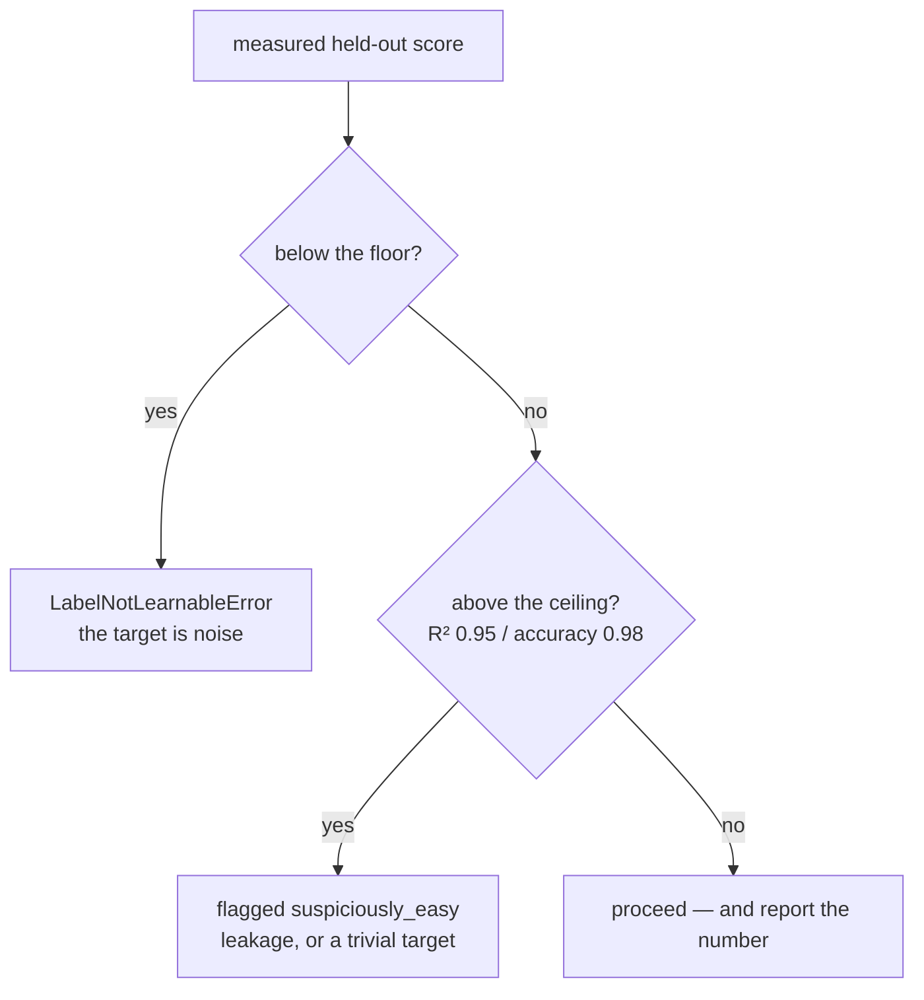

# 03 · The data problem

[← 02](02-ml-concepts-you-need.md) · [Index](00-index.md) · Next: [04 · The pipeline](04-the-pipeline.md)

**This is the most important chapter in the track.** Everything else in this repository is
competent engineering. This part is the difference between a demo that survives questions and
one that does not.

---

## 1. Two ways synthetic data kills a demo

You have no real dataset. You have a domain and a deadline, so you *generate* data. There are
exactly two ways that goes wrong, and they are mirror images.

### Failure A — the label is noise

You write a generator that produces plausible-looking shipments and then draws the target
independently of them: `spoilage_risk_pct = random.gauss(35, 12)`.

Nothing catches this. Read that again — **nothing in the Aegis platform catches this.** All
fourteen conformance checks pass, because they check the adapter's *structure* and a noise
label is structurally perfect. The whole backend test suite passes. `ruff` passes.

The only native symptom anywhere in the platform is the word `distinct=False` on the last
line of `python -m app.ml`, which you read minutes before the demo, at which point the fix is
a regenerate-and-retrain cycle you no longer have.

### Failure B — the label is trivial

The opposite, and much more common because it feels like success. You write a latent function
— a formula from the features to the target — add a whisper of noise, and get **held-out
R² ≈ 0.99**.

That number is not an achievement. **It is a bug report.** Here is what it actually means:

* The target is a closed-form function of the inputs. You wrote a formula and then fitted it.
  There was nothing to learn.
* The residuals are near zero, so the conformal interval calibrated on them is a hairline.
  An interval of `±0.4 %` impresses nobody and informs no decision.
* The entire "uncertainty you can audit" story — the reason Aegis exists — collapses. There
  is no uncertainty to audit.
* Any judge or reviewer who has trained a model will spot it in one glance and stop believing
  the rest of your numbers.

Real tabular problems of this size do not reach 0.95 out of a gradient-boosted ensemble on a
few thousand rows. If yours does, one of three things is true, all bugs: a leaked feature, a
target trivially recoverable from one column, or a noise term that never fired.

---

## 2. The latent function

The fix for Failure A is to make the target a **declared function of the features, plus
noise**. That function is called the **latent function** — "latent" because the model never
sees it, it only sees the data it produced.

In the reference domain the latent function is a table of declared drivers, written as plain
data in [`reference/adapter/ml_spec.py`](../../reference/adapter/ml_spec.py) and re-expressed
as a `LatentModel` in [`reference/problem.py`](../../reference/problem.py). Its shape:

```
spoilage_risk_pct  =  intercept
                    + Σ driver(feature)          # e.g. transit_hours via log1p, ambient heat via tanh
                    + interaction term           # transit_hours × packaging_type == passive_gel
                    + Σ confounders              # real effects, never emitted as columns
                    + noise                      # calibrated — see §3
                    , clipped to [0, 100]
```

Two properties make this the right structure:

* **It is monotone and smooth in each driver.** Longer transit is worse, hotter ambient is
  worse, more handoffs are worse. That is a claim the domain expert would recognise, which
  means the SHAP report becomes readable as domain evidence rather than as arithmetic.
* **It is not linear.** `log1p` and `tanh` shapes plus one interaction term mean a straight
  ridge regression cannot recover it exactly — so the boosted ensemble has something to prove.

The guarantee that matters: because labels are *sampled around* this function, there is real
signal to find. Failure A is designed out.

---

## 3. Calibrated noise: the single most important line in the repo

Failure B is designed out by **calibrating the noise instead of guessing it.**

Someone typing `noise_scale = 4.0` is guessing. Whether that yields R² 0.55 or R² 0.98
depends entirely on how large the signal happens to be, which depends on coefficients they
also typed by feel. Realism becomes an accident.

Instead, you *declare the ceiling you want* and solve for the noise:

```
sigma = sqrt(var_signal * (1 - target_r2) / target_r2)
```

Read it as: R² is the share of the target's variance that the signal explains. Fix that share
at `target_r2`, measure the signal's actual variance from the generated rows, and the noise
standard deviation follows by algebra. **Realism becomes a declared property you can verify,
not a number somebody tuned by feel.**

The reference domain declares `TARGET_R2 = 0.74`. Measured in the committed run:

| Quantity | Value |
|---|---|
| signal variance | 159.73 (percentage-points²) |
| confounder variance | 22.45 |
| noise σ (solved) | **5.803** percentage points |
| noise-to-signal | 0.593 |
| implied analytic R² ceiling | **0.740** |
| oracle R² (a model that *knows* the function) | 0.7397 |
| **achieved held-out R²** | **0.7199** |

Note what `TARGET_R2 = 0.74` is and is not. It is what an **oracle** would score — something
that already knew the generating function. A real model must *estimate* that function from a
finite sample, so it lands below. On ~1,500 labelled rows the measured gap is about two
points of R² for this run (0.7199 vs 0.7397 — 97 % of oracle on the test split; the whole-frame
probe reports 90.8 %).

---

## 4. The five realism devices

A calibrated ceiling alone is not enough — you also need the data to *behave* like real data.
Five devices are declared, each buying something specific.

### 4.1 Unobserved confounders

Drivers that genuinely move the target and are **never emitted as columns**.

The reference domain declares two, and they are real things nobody records at booking time:

* `unrecorded_tarmac_delay` — how long the pallet sat on hot tarmac waiting for a slot.
* `undocumented_precool_quality` — how thoroughly the shipper pre-cooled the packout.

**What it buys:** an irreducible ceiling that no model can cheat past, and — crucially — one
that has a *name*. A model card can say "10.4 % of the target's variance is structured but
unobserved, and here is what it is" instead of "the residual is noise", which is a far weaker
claim. `CONFOUNDER_SHARE = 0.4` means two fifths of everything the model cannot explain is
these two drivers and three fifths is plain measurement noise.

### 4.2 Heteroscedastic noise

**Heteroscedastic** = the spread of the errors is not the same everywhere. Here the noise
width scales with `transit_hours`: σ runs from `σ/1.6` on the shortest lanes to `σ·1.6` on the
longest.

The domain justification is real: long lanes are not merely riskier on average, they are
*less predictable* — more of the journey is outside anyone's direct control.

**What it buys:** an honest reason for an interval to breathe. Under constant-width noise a
single conformal band is optimal and there is nothing to demonstrate. Under this, a fixed band
is provably too wide somewhere and too narrow somewhere else — which is exactly the finding
chart 03 surfaces.

Measured in the committed run: residual σ **5.68** in the lowest decile of predictions versus
**10.57** in the highest, a spread ratio of **1.86**.


The x axis is what the model predicted; the y axis is `measured − predicted`. The pale
envelope is a rolling ±1σ over a 20-row window. It is visibly narrow around predictions of
10–20 % and visibly wide around 50–60 %. That fan **is** the heteroscedasticity, and seeing it
means the generator did what it documented.

The dark orange line is the rolling *mean* residual. It stays close to zero across the range
(overall mean **+0.195** points against σ **7.95**), which is the other thing this chart is
for: a rolling mean that drifts away from zero would be **bias**, not noise, and no amount of
interval width fixes bias.

### 4.3 MAR missingness

**MAR** = missing at random: a value is absent, and whether it is absent depends on *another
observed column*, not on the missing value itself.

The reference rule: `sensor_gap_minutes` goes unpublished on `carrier_tier = economy` lanes.
Realised in the committed frame at **4.23 %** of rows.

**What it buys:** the difference from MCAR (missing *completely* at random) is the entire
point. Under MCAR, filling holes with the median is unbiased and demonstrating it proves
nothing. Under MAR, the imputed rows are systematically riskier than the observed ones — so
the spine's `MLExplainResponse.imputed_features` field, which tells a reviewer *which* values
were filled in, becomes information somebody can act on rather than trivia.

### 4.4 Irrelevant features

Columns generated genuinely independently of the target. Here: `origin_region` and
`payload_kg`.

**What it buys:** a SHAP report that correctly puts them near zero is far stronger evidence
than one where every column happens to matter. Measured: together they absorb **3.2 %** of
total attribution (chart 04 in [chapter 02 §6](02-ml-concepts-you-need.md#6-shap--why-did-the-model-say-that)).
They are left in the chart and annotated rather than hidden — the *absence* of importance is
the finding.

### 4.5 Interaction terms

An **interaction** is an effect that depends on two features jointly. The reference domain
declares one: transit duration costs far more under `passive_gel` packing than under an
active reefer (coefficient 7.0).

**What it buys:** a purely additive latent function is exactly recoverable by ridge
regression. Without at least one interaction (or a non-monotone shape), a linear model matches
the boosted ensemble and the entire AutoML stack has nothing to prove on the demo data. One
honest interaction fixes that, and it is a real operational claim.

> **A sixth device, for classification only: label flipping.** `LABEL_FLIP_RATE = 0.03`
> corrupts 3 % of `excursion_flag` labels — chosen from the rows *nearest the decision
> boundary*, because that is where real measurement error lives. Uniform random label noise is
> the wrong model of the world.

---

## 5. The realism report

All of the above is measured and drawn, not asserted:


**Left panel — achieved vs the band and the ceiling.** Four bars, in increasing order of what
they know:

| Bar | Value | Meaning |
|---|---|---|
| probe on the whole frame | 0.672 | the fast learnability check (§6) |
| held-out (this model) | 0.720 | the real, honest score |
| oracle (latent signal) | 0.740 | a model that already knew the function |
| analytic ceiling | 0.740 | `var_signal / (var_signal + var_confounder + σ²)` |

The shaded region is the **realism band `[0.45, 0.80]`**. Landing inside it is the pass
condition. The gap between the held-out bar and the oracle bar is *estimation* error — the
price of having only 2,034 rows. The gap between the oracle bar and 1.0 is *irreducible* —
nothing can close it.

**Middle panel — where the target's variance comes from.** 74.0 % latent signal, 10.4 %
unobserved confounders, 15.6 % noise. Noise-to-signal 0.593. This is the picture that makes
"31 % of the variance is irreducible and most of it has a name" a checkable statement.

**Right panel — realised missingness.** One bar: `sensor_gap_minutes` at 4.23 %. It shows what
the generator *actually produced*, not what it was asked for.

---

## 6. The learnability guard fires in both directions

`aegis_ml.data.latent.assert_learnable` fits a fast model on the frame and checks the held-out
score against **two** bounds. It runs in seconds, and it runs *before* anything expensive.



Both directions are verified on this stack:

| Probe | Result |
|---|---|
| target replaced with pure noise | raises `LabelNotLearnableError` |
| target made a deterministic function of one column | R² **0.994**, flagged `suspiciously_easy` |
| the reference domain | R² 0.656 / 0.588 / 0.6391 / 0.672 across runs — **inside the band, never above it** |

Why an AutoML search cannot substitute for this check: a search over a target with no signal
spends its entire budget discovering that, and reports it as a leaderboard of models that all
failed equally — which reads like a *hard problem* rather than a *broken generator*. The probe
answers the same question in seconds and names it correctly.

> **Two bands, two names — a real inconsistency to know about.** The **realism band** is
> `[0.45, 0.80]` for R² (`REALISM_R2_BAND` in `pipelines/flows.py`) and it is what `doctor`,
> `data_flow` and the realism chart use. The **learnability guard band** is wider —
> `settings.learnable_r2_floor = 0.15` up to `R2_CEILING = 0.95` — because it is a hard refusal,
> not a quality judgement. `registry_store/RUN_SUMMARY.md` labels the wider pair "realism band",
> which is confusing; the chart and the console output use the narrower one. Read the numbers,
> not the label.

---

## 7. Why we did not copy Aegis's own generator

Aegis ships its own reference generator at
`backend/src/app/adapter/generator.py`. It uses a flat `noise_scale = 4.0` against a latent
signal spreading roughly 30 hours, which lands it around **R² 0.97–0.98**.

That is Failure B, present in the code this package pattern-matched from. It is not a bug in
Aegis — for demonstrating the *platform* it is harmless. But copying it would import the exact
failure `aegis_ml` exists to prevent.

So the templates and the reference domain use calibrated σ instead. Recorded as issue #15 in
[`ISSUES.md`](../../ISSUES.md): *"Not our bug, but worth knowing before copying anything from
it."*

---

## 8. The checklist

When you generate data for a new domain, in this order:

1. Write the latent function as **declared data** — a table of drivers, not code buried in a
   loop. One table, evaluated in one place.
2. Declare `target_r2` (or `target_accuracy`) and let σ be **solved**, never typed.
3. Add at least one unobserved confounder, one interaction, heteroscedastic noise, a MAR
   missingness rule, and two features with no driver at all.
4. Run `assert_learnable` **before** anything expensive.
5. Read the realism report. Inside the band is the pass condition. Above it is a bug report.

Then look at your R². If it is 0.99, go back to step 2.

Next: [04 · The pipeline](04-the-pipeline.md)
