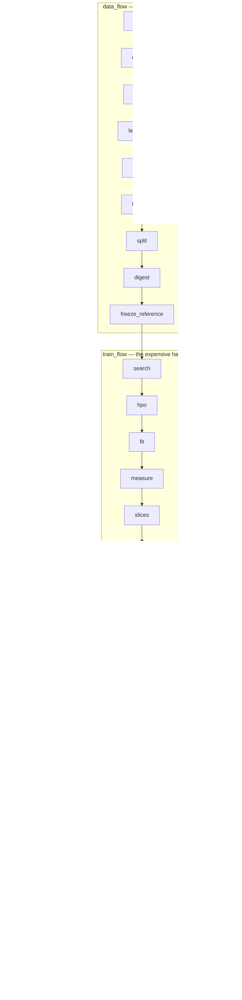

# 04 · The pipeline

[← 03](03-the-data-problem.md) · [Index](00-index.md) · Next: [05 · Reading the charts](05-reading-the-charts.md)

Everything `aegis_ml` does is exposed as a **flow** — an ordinary Python function that runs a
sequence of named **stages** and records what each one did. They live in one file:
[`src/aegis_ml/pipelines/flows.py`](../../src/aegis_ml/pipelines/flows.py).

---

## 1. The seven flows

| Flow | CLI command | What it does |
|---|---|---|
| `data_flow` | *(no direct command — runs inside `train`)* | Establish that a dataset is fit to train on, and freeze what training will need |
| `train_flow` | `aegis-ml train` | Search, tune, fit, measure, explain and register one model |
| `eval_flow` | `aegis-ml eval` | Re-score a registered run on data it has never seen |
| `promote_flow` | `aegis-ml promote` | Judge a challenger against the champion; replace the served artifact only if it wins |
| `drift_flow` | `aegis-ml drift` | Measure how far live data has moved, and estimate performance without labels |
| `forecast_flow` | `aegis-ml forecast` | Forecast one time series and report the coverage the band actually achieved |
| `full_flow` | `aegis-ml train --full` | train → promote → drift, under **one** manifest — the demo bundle |

Two properties they all share:

* **They are plain functions.** Prefect (a workflow orchestrator) is applied as a decorator
  *if it is installed*, and as an identity decorator otherwise. A trained artifact never
  depends on a server being up. Decision **D4** in [`finalplan.md`](../../finalplan.md).
* **They write a manifest.** Every stage records its inputs, outputs, row counts, notes and
  metrics into a `RunManifest`, written as `manifest.json` in the run directory. A flow that
  *fails* still closes and writes its manifest first, so a broken run leaves a readable record
  naming the stage that broke.

---

## 2. The main path, end to end



---

## 3. `data_flow` — nine stages, all cheap

The order is deliberate: everything here runs **before** anything expensive, because these are
the checks that make the expensive stages meaningful.

| Stage | What it does | Refuses when |
|---|---|---|
| `ingest` | Resolve the frame (caller → path/callable → the champion's frozen reference) and confirm every declared column is present | no source at all → `FrameSourceMissingError`; a missing column → `ValueError` |
| `contract` | Validate dtypes, ranges, null policy and categorical level sets with **pandera** | recorded as `contract_ok=False`, which fails gate criterion 3 later |
| `profile` | Write a **skrub** `TableReport` HTML data profile | — |
| `learnability` | Fit a fast model; check the label carries signal | below the floor → `LabelNotLearnableError` |
| `realism` | Decompose variance, compare against the band and the oracle | above the ceiling → flagged `suspiciously_easy` |
| `leakage` | Audit each feature for suspicious predictive power | findings recorded; fails gate criterion 5 |
| `split` | Three disjoint splits, seeded | — |
| `digest` | SHA-256 fingerprint of the features + target columns | — |
| `freeze_reference` | Write `reference.parquet` — the baseline drift will later compare against | — |

The `ingest` stage also notices nulls and says so explicitly, because in this package nulls
are *expected*: `nulls present (expected — MAR missingness is part of a realistic frame)`.

`aegis-ml contract` is the standalone shortcut to the three checks that matter most here — the
pandera contract, the leakage scan and `assert_learnable` — run directly rather than through
the flow, so you can sanity-check a frame in seconds without minting a run.

The **digest** deserves a note. `frame_digest` folds the column names into a SHA-256 of the
data itself, so a mismatch proves a model was not fitted on the frame you believe it was, and
a rename cannot pass unnoticed. It is tamper-**evidence**, not tamper-prevention — nothing
screens a poisoned frame, it is simply fingerprinted on the way in.

---

## 4. `train_flow` — the expensive half

| Stage | What it does |
|---|---|
| `search` | Run the AutoML tiers; produce a `Leaderboard` including every loser and every skipped tier's reason |
| `hpo` | Optuna study over the winning recipe (skip with `--no-hpo`) |
| `fit` | Fit the winning recipe on the training split |
| `measure` | Score on the test split; measure conformal coverage on it |
| `slices` | Re-score the metric within every segment of every feature |
| `shap` | Global attribution over held-out rows; write `shap.html` |
| `card` | Write the model card as Markdown and HTML |
| `register` | Write `entry.json` and update the registry index |
| `visuals` | Render the nine charts plus `index.html` and `interactive.html` |

> **The order is not negotiable.** The split happens before the fit, because a calibration
> split carved out afterwards has already been seen. The measurement happens on rows that
> neither the fit nor the calibration touched, because that is the only reason to believe it.

`search` is the **only** stage with retries, and deliberately so: it is the only one whose
failure can be transient (a cold trainer venv, a subprocess killed under memory pressure).
Retrying a deterministic stage just re-derives the same exception.

There is also a **stage cache**: a stage whose content-addressed inputs are unchanged is
skipped on a re-run, so a crash after a five-minute search does not repeat the search.
`--force` bypasses it.

### What a run directory contains

After a `full_flow` on the reference domain, `registry_store/runs/<run_id>/` holds:

```
entry.json          the registry record: result, gate decision, paths
problem.json        the MLProblem, so the run is self-describing
manifest.json       stage-by-stage lineage (plus manifest_promote/manifest_drift)
metrics.json        the headline numbers, flat
model.joblib        the fitted model
recipe.json         the portable recipe (see §6)
leaderboard.json    every candidate, winners and losers
split.json          the seed and fractions, so the exact test rows are recoverable
reference.parquet   the frozen baseline for drift
current.parquet     the live frame the drift run compared against
gate_inputs.json    contract + leakage status, for the promotion gate
drift.json          the DriftReport
card.md / card.html the model card
shap.html           the SHAP report
profile.html        the data profile
visuals/            9 PNGs + index.html + interactive.html + manifest.json
```

---

## 5. The other four flows

**`eval_flow`** re-scores a registered run on *fresh* labelled data. Its stages are `load_run`
→ `ingest` → `rescore` → `slices`.

It has one behaviour worth knowing: re-scoring with **no** fresh data would use the run's whole
reference frame, training rows included, which is in-sample and flattering. That default used
to be silent. It now raises `InSampleEvaluationError` unless you pass `--allow-in-sample`, and
the opt-in path labels the output `IN-SAMPLE`. Measured on the demo model: 0.7587 in-sample
against the honest held-out 0.7224 — precisely the optimism the refusal exists to prevent.

**`promote_flow`** runs `gate` then `apply`. Chapter [06](06-mlops-registry-gate-drift.md)
covers the five criteria.

**`drift_flow`** runs `load_reference` → `drift` → `estimate_performance` → `alerts` →
`visuals`. Also chapter 06.

**`forecast_flow`** runs `forecast` → `rank` over a time series, wrapping Aegis's own
`aegis.forecast` rather than reimplementing it. It refuses rather than degrading: too little
history raises `InsufficientHistoryError`; a completely flat series raises
`DegenerateSeriesError`, because 100 % coverage from a zero-width band is not a measurement;
and if every candidate fails there is no naive-line fallback, only `ForecastFitError`.

---

## 6. Two virtualenvs, one portable recipe (decision D1)

This is the keystone of the architecture, and it is easier than it sounds.

**The problem.** The Aegis backend carries hard version caps: `pandas>=2.2,<2.4`,
`numpy>=1.26,<2.5`, `numba==0.67.0`. AutoGluon, TabPFN and torch bring their own floors that
fight those caps. Installing them into the backend's environment is the single most likely way
to lose a morning.

**The solution.** Install everything, but isolate the heavy half:

| Virtualenv | Holds | Used for |
|---|---|---|
| `.venv` (serving) | pandera, skrub, optuna, flaml, evidently, nannyml, mapie, shap, typer — all pure Python, all inside the caps | serving, promotion, drift, the FastAPI router, the adapter tools |
| `.venv-ml` (trainer) | the above **plus** AutoGluon, TabPFN, torch, SDV, mlforecast | AutoML search, foundation models, synthetic-data fitting |

**The bridge is a `Recipe`** — plain JSON describing *which estimators, with which settings*,
rather than a pickled model. The trainer venv runs the search and returns:

```json
{
  "task": "regression",
  "members": [{"name": "xgb_limitdepth", "kind": "XGBRegressor",
               "params": {"n_estimators": 950, "max_depth": 2, "learning_rate": 0.0749, ...},
               "weight": 1.0}],
  "categorical_features": ["carrier_tier", "route_class", ...],
  "numeric_features": ["transit_hours", "ambient_temp_c", ...],
  "tier": "flaml",
  "search_seconds": 171.85,
  "notes": ["..."]
}
```

`aegis_ml.automl.recipe.to_aegis_members(recipe)` turns that into exactly the shape Aegis's own
`aegis.ml.model._regression_members()` returns, and the Aegis spine fits it — keeping its MAPIE
conformal calibration, its SHAP, its model card and its dataset digest. **Full AutoML benefit,
zero changes to the Aegis core.**

The design rests on one fact that was checked rather than hoped: `pandas`, `numpy` and
`scikit-learn` resolve to **2.3.3 / 2.4.6 / 1.9.0** in *both* venvs, byte-identical. A model
re-fitted from its recipe in the serving venv therefore sees the same numerics.

### Portability is decided by a fit, not by an import

`kind` is a class name the serving venv must be able to construct. It goes through an explicit
allowlist, and anything unknown raises `RecipeNotPortableError` rather than importing a name a
search result asked for.

But importability is not enough. A real case from this stack: `nannyml` pins `lightgbm<4.6`,
and lightgbm below 4.6 has a scikit-learn wrapper that is broken against sklearn ≥ 1.8. So
`import lightgbm` succeeds and `LGBMRegressor(...).fit(...)` raises. The first version of
`is_portable_kind` checked only importability, accepted `lgbm`, and the FLAML tier died partway
through a demo run.

The fix: `is_portable_kind` now also *fits a two-row probe*. Version arithmetic across three
packages would not have answered the question; a fit does. LightGBM is correctly excluded,
FLAML runs clean, and in the committed run the FLAML tier wins. Full analysis in
[`RESOLUTION.md`](../../RESOLUTION.md).

---

## 7. Non-portable winners are reported, not hidden


The committed run's best score was `ridge_reference` at **0.7460** — hatched, and *not*
promoted. It is a linear model, and Aegis explains with `shap.TreeExplainer`, which handles
trees only. Promoting it would train, score, and then raise inside `explain()` on the first
request asking why.

So it is reported as the **accuracy ceiling**, in the recipe's own notes:

> ACCURACY CEILING: 'ridge_reference' (tier baseline) scored r2=0.7460 but was NOT promoted …
> The promoted recipe 'flaml_xgb_limitdepth' (tier flaml) scored r2=0.7379 — a gap of +0.0080
> on the held-out split. Report the ceiling as evidence of headroom, never as this model's
> performance.

The same treatment applies to an AutoGluon stacked ensemble or a TabPFN model, neither of which
re-fits in the serving venv: their scores go on the card as the ceiling, the best *portable*
candidate becomes the recipe, and the reader can see exactly what was traded away.

---

## 8. Where the settings actually live

`config/*.toml` is heavily commented and reads like configuration. **It is not read by any
code** — nothing in `src/` imports `tomllib`. Treat those files as design documentation.

The values in force:

| Setting | Default | Where |
|---|---|---|
| `random_seed` | 7 | `settings.py` · `AEGIS_ML_RANDOM_SEED` |
| `automl_time_budget` | 300 s | `settings.py` · `AEGIS_ML_AUTOML_TIME_BUDGET` |
| `requested_coverage` | 0.9 | `settings.py` · `AEGIS_ML_REQUESTED_COVERAGE` |
| `coverage_tolerance` | 0.05 | `settings.py` · `AEGIS_ML_COVERAGE_TOLERANCE` |
| `promote_min_gain` | 0.005 | `settings.py` · `AEGIS_ML_PROMOTE_MIN_GAIN` |
| `learnable_r2_floor` | 0.15 | `settings.py` |
| `enable_tabpfn` | `True` | `settings.py` · `AEGIS_ML_ENABLE_TABPFN` |
| realism band (R²) | `(0.45, 0.80)` | `flows.REALISM_R2_BAND` |
| realism band (accuracy) | `(0.62, 0.92)` | `flows.REALISM_ACCURACY_BAND` |
| suspiciously-easy ceilings | 0.95 / 0.98 | `latent.R2_CEILING`, `latent.ACCURACY_CEILING` |

Note the accuracy band: `config/contracts.toml` says `[0.65, 0.88]`, and the code uses
`(0.62, 0.92)`. The code wins.

Next: [05 · Reading the charts](05-reading-the-charts.md)
