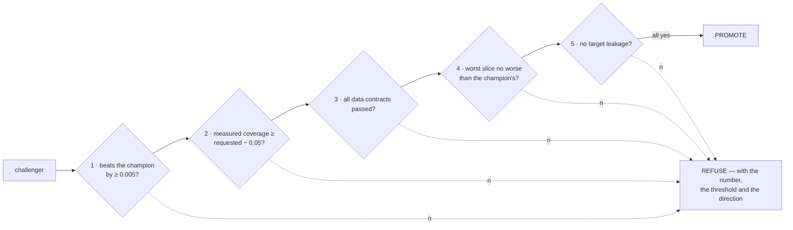

# 06 · MLOps: registry, gate, drift

[← 05](05-reading-the-charts.md) · [Index](00-index.md) · Next: [07 · How it plugs into Aegis](07-how-it-plugs-into-aegis.md)

"MLOps" is the operational half: what happens *after* a model is trained. Storing it, deciding
whether it may replace the one currently in use, undoing that decision, and noticing when the
world moves out from under it.

---

## 1. What a model registry is

A **model registry** is the record of every model you have trained: what it scored, on what
data, with what settings, and which one is currently live.

Without one you have a `.joblib` file on disk and no answer to "what is this, and was it
better than the last one?"

`aegis_ml`'s registry is **the filesystem**, rooted at `registry_store/`:

```
registry_store/
├── index.json              a derived cache — rebuildable from the runs
├── runs/<run_id>/          one immutable directory per run
│   ├── entry.json          the RegistryEntry: result, gate decision, every path
│   ├── model.joblib        the fitted model
│   └── …                   card, leaderboard, reference frame, charts …
├── reports/                drift HTML, data profiles
├── unregistered_artifacts/ models found serving with no registry row behind them
└── optuna/studies.db       resumable hyperparameter studies
```

**Why the filesystem is the source of truth**, and not a database or MLflow:

* It works with nothing running. A demo must never depend on a server being healthy.
* It is inspectable with `ls` and `cat`, which matters when something is wrong at 3 a.m.
* It survives the machine being rebooted, the network being down, and Postgres not being
  configured.

MLflow is supported as an **optional mirror** for lineage and a nicer UI; optional SQLAlchemy
tables exist too. Neither is authoritative. Decision **D3** in [`finalplan.md`](../../finalplan.md).

Run ids are minted as `<domain_id>-<UTC timestamp>-<short hash>`, so they sort
chronologically. They are validated to reject anything that could escape `runs/` — and also
anything that could collide with a shell glob, after a test found that `wild*card` passed the
path-escape check and would make `rm -rf runs/<id>` mean something other than it reads like.

List what you have:

```bash
.venv/bin/aegis-ml registry
```

```
run_id                                         stage       metric         value   req     emp  created
--------------------------------------------------------------------------------------------------
cold_chain_logistics-20260824T030131425-34e3f5 production  r2            0.7199   90%   91.4%  2026-08-24T03:04:55.766763+00:00
```

Both coverage numbers are in that table by design — see
[chapter 02 §5](02-ml-concepts-you-need.md#requested-vs-measured--never-one-number).

---

## 2. Champion and challenger

* The **champion** is the model currently serving. Exactly one per domain, marked
  `stage: production`.
* A **challenger** is any newly trained run, marked `stage: staging`.
* A challenger becomes the champion only by passing the **promotion gate**. The displaced
  champion is marked `archived` and kept.

Promotion in Aegis means one concrete thing: **atomically replacing the file
`backend/.artifacts/ml_spine.joblib`**, which is the path `aegis.ml.get_model()` already loads
from. No core change is needed for a trained model to reach the platform; it is the same file,
written by a gate instead of by hand.

That is also why promotion is careful about what it overwrites. `_archive_live_artifact`
handles three real cases:

| Case | What happens |
|---|---|
| No live artifact | First promotion on this host — nothing to preserve |
| Live artifact, known champion | Copied into `runs/<champion>/model.joblib`, unless the bytes are already identical |
| Live artifact, **no** champion row | Preserved under `registry_store/unregistered_artifacts/` with a UTC stamp |

The third case is the one an unconsidered implementation destroys. It is what you get when
someone ran `python -m app.ml` by hand: a real serving model with no registry entry behind it.
The committed repo has one such file preserved.

After the copy, the installed file's SHA-256 is **verified**. A full disk truncates the temp
file and `os.replace` will happily publish a truncated one; verifying turns that into a loud
failure at promotion time instead of a pickle error the next time the backend restarts.

---

## 3. The five promotion criteria

A challenger is promoted only if **all five** hold. Each is reported with its number, on a pass
as well as a failure — because `promoted=True` with no figures is exactly as opaque as
`promoted=False` with no figures, and the model card quotes both.



**1 · Beats the champion on the primary metric by at least `promote_min_gain` (0.005).**
The margin exists because on genuinely noisy data — held-out R² in the 0.45–0.80 band this
package targets — a point or two of fold-to-fold movement is normal, and promoting on it is
promoting noise. Direction comes from a metric table, never from a bare `>`: lower is better
for RMSE, higher for R².

**2 · Measured coverage clears the requested level minus `coverage_tolerance` (0.05).**
So a requested 90 % must measure at least 85 %. A challenger with *no* measured coverage
**fails** this check. Unmeasured is not the same as met, and defaulting the other way would
promote an uncalibrated interval into a system whose entire value proposition is the calibrated
interval.

**3 · All data contracts passed.** The pandera contract is what stands between the model and a
frame whose columns silently changed meaning. If `gate_inputs.json` was never written, the
contract status is treated as **unproven**, i.e. failing — a gate input that was never recorded
is not a passing one.

**4 · The worst slice is no worse than the champion's worst slice.** Deliberately the *worst*,
not the mean. A model that improves on average while collapsing on one region is a regression
for everyone in that region, and the collapsed region's error is diluted by its own small share
of the rows — so the headline moves the right way while that population's experience gets
worse. Tolerance defaults to `0.0`: no regression permitted.

**5 · No target leakage was flagged.** A leaking feature produces the best held-out score in the
run and the worst behaviour in production. Criterion 1 actively *rewards* leakage, so criterion
5 has to be able to overrule it.

### The real decision from the committed run

```
PASS beats_champion (trivially): no champion exists for domain 'cold_chain_logistics', so
  there is nothing to beat. This model is promoted as the first baseline at r2=0.7199, NOT
  because it outperformed anything. Every later challenger is measured against this number.
PASS coverage_meets_request: measured 0.914 against a requested 0.900 (floor 0.850 =
  requested − tolerance 0.050), on 407 held-out rows.
PASS contracts_pass: every declared data contract validated the training frame — dtypes,
  ranges, null policy and categorical level sets.
PASS worst_slice_not_worse (no baseline): no champion exists, so the challenger's worst
  segment cannot have regressed. Its worst segment is handoff_count=q2 (1.0, 2.0] (n=97)
  at 0.4513 — this becomes the floor every later challenger must hold.
PASS no_target_leakage: the feature audit flagged nothing.
PROMOTED: 5/5 criteria passed. All five are required — they cover different failure modes
  and none substitutes for another.
```

Notice the honesty in criteria 1 and 4: a first model has nothing to beat, and the reason
string *says* it passed trivially. "Promoted, beat the champion" written about a run with no
champion is a lie the model card would then repeat.

### Overriding a refusal

`aegis-ml promote --force` promotes despite a failed gate. It does **not** fabricate the
decision: `promoted` still records what the gate computed, every failed check keeps its reason,
and the override is appended to the reasons list. An operator reading the registry afterwards
can see that a human overrode a refusal — which is the only thing that makes an override
acceptable.

---

## 4. Rollback

```bash
.venv/bin/aegis-ml rollback --domain-id cold_chain_logistics
```

`promote` archives exactly the run it displaced, so rollback walks archived runs newest-first
and restores the first one with a stored `model.joblib`. The current champion is demoted to
`archived` and the restored run becomes `production` — so a *second* call rolls back one more
step, rather than ping-ponging between two models.

If there is nothing to restore, it raises `FileNotFoundError` naming the archived runs it
looked at and stating that the serving artifact is unchanged. **A rollback that silently did
nothing is the worst possible outcome of a rollback.**

---

## 5. Drift

**Drift** is the world changing so that live data no longer resembles the data the model was
trained and calibrated on. It is the reason a model that was correct in March is quietly wrong
in September.

`aegis_ml` measures it two ways, because they answer different questions.

### 5.1 Evidently — what moved

Evidently compares the live frame against the **exact frame the model was calibrated on**
(`reference.parquet`, frozen by `data_flow`) and reports which features moved. Numerics are
compared with a Kolmogorov–Smirnov statistic, categoricals with total variation distance.

The verdict comes from the **share of features that drifted**, not from a single p-value:

| Drifted share | Verdict |
|---|---|
| < 0.2 | `pass` |
| ≥ 0.2 | `warn` |
| ≥ 0.4 | `block` |

A share rather than a p-value on purpose: with ten features, one drifting at p < 0.05 is
expected by chance about 40 % of the time, so a per-feature test alone fires constantly on
sampling noise and gets ignored.


The committed run: 7 of 10 features flagged, share **0.70**, verdict **`block`**. The strongest
movers are `route_class` (total variation 0.544 — `multi_leg` went from ~18 % of shipments to
~72 %) and `carrier_tier` (0.468 — `economy` from ~30 % to ~76 %).

Evidently needs no labels. But it also cannot tell you whether the movement *hurt*.

### 5.2 NannyML — estimated performance, before the labels arrive

This is the strongest single capability in the stack, and the one most often misread.

In production you get features immediately and labels **later** — days or weeks later, when the
shipment is received and assayed. Ordinary monitoring can only score a model once the truth
arrives. By then the damage is done.

**NannyML estimates the metric without any ground truth.** For regression it uses DLE (Direct
Loss Estimation); for classification, CBPE (Confidence-Based Performance Estimation). Both work
from the model's *own* outputs under the observed covariate shift: they learn how the model's
error behaves as a function of its inputs on the reference data, then apply that to the
unlabelled live data.

The committed run reports:

```
estimated_metric_name  = "estimated_rmse"
estimated_metric_value = 6.6649
```

**`estimated` is not `measured`, and the naming enforces it.** Every field carrying a NannyML
number is prefixed `estimated_*` throughout `DriftReport`, exactly as `requested` and
`empirical` coverage are kept apart. An estimate is evidence that something is going wrong
early enough to act; it is not a score. On a separate probe of this stack, NannyML's DLE
returned `estimated_rmse = 2.07 [1.71, 2.44]` on unlabelled current data, confidence interval
included.

### 5.3 What a `block` verdict actually blocks

**It does not withdraw the model.** Aegis serves the model it has and flags it. Withdrawing a
model on a drift signal would be a silent downgrade, which is the one thing this platform
refuses to do.

What `block` blocks is **promotion**: nothing calibrated on a reference frame that no longer
describes the world may become the new champion. The right response is to retrain on current
data, not to turn the model off.

---

## 6. Slices, again — because the gate reads them


Gate criterion 4 reads exactly one number off this chart: the **worst** bar.
`handoff_count = q2 (1.0, 2.0]` at **0.4513** over 97 rows. Because this run had no champion,
that number becomes the floor. A future challenger scoring an aggregate 0.75 but 0.41 on that
segment is refused, and told which segment and by how much.

That single rule is the difference between "our model improved" and "our model improved for
everyone".

---

Next: [07 · How it plugs into Aegis](07-how-it-plugs-into-aegis.md)
