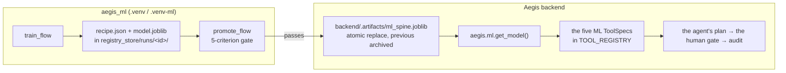

# 07 · How it plugs into Aegis

[← 06](06-mlops-registry-gate-drift.md) · [Index](00-index.md) · Next: [08 · Your first run](08-your-first-run.md)

This chapter connects the two halves: how a domain adapter is shaped, and how a model trained
by `aegis_ml` reaches an Aegis agent without editing the Aegis core.

The reference version of this material is
[`docs/02-domain-adapter-contract.md`](../02-domain-adapter-contract.md) and
[`docs/07-integration-with-aegis.md`](../07-integration-with-aegis.md). This is the beginner's
route through it.

---

## 1. The `DomainAdapter` Protocol

A **Protocol** in Python is structural typing: you satisfy it by *having the right attributes*,
not by inheriting from anything. No base class, no registration, no decorator.

```python
import myapp.adapter
from aegis.adapter import DomainAdapter, missing_members

assert not missing_members(myapp.adapter)        # every member present
assert isinstance(myapp.adapter, DomainAdapter)  # runtime_checkable
```

That is the whole conformance surface: **eleven members across ten pieces**.

| # | Piece | File / dir | Member | What the platform reaches through it |
|---|---|---|---|---|
| 1 | schema | `schema.py` | `schema` | The domain's record types and their version |
| 2 | ml spec | `ml_spec.py` | `ml_spec` | Features, target, the training frame |
| 3 | generator | `generator.py` | `generator` | The synthetic world **and** the client-facing demand series |
| 4 | tools | `tools.py` | `tools` | The action registry, its risk tiers, the allowlist |
| 5 | personas | `personas.py` | `personas` | Who is asking, and what each may see |
| 6 | prompts | `prompts.py` | `prompts` | The persona system prompt and the platform floor |
| 7 | memory spec | `memory_spec.py` | `memory_spec` | What counts as a durable fact — and `SKILLS_DIR` |
| 8 | roster | `roster.py` | `roster` | The specialists routed between |
| 9 | corpus | `corpus/` | `corpus` | Seed documents the agent can cite |
| 10 | skills | `skills/` | *(none)* | Playbooks, discovered via `memory_spec.SKILLS_DIR` |

Plus two identity members on the package itself:

```python
DOMAIN_ID: str            # stable machine id
DOMAIN_DESCRIPTION: str   # one paragraph — AND the guardrails' allowed_topics
```

`DOMAIN_DESCRIPTION` is **not metadata**. Aegis's guardrails import it and wire it straight in
as `allowed_topics`. A vague description is a loose safety rail; an absent one is no rail at
all.

> **The trap that bit the reference adapter itself.** Members are attributes of a *package*,
> and a submodule becomes an attribute of its parent only once something **imports** it. An
> adapter whose `__init__.py` never touches `memory_spec` does not *have* a `memory_spec`
> member, however present the file is on disk. `missing_members(app.adapter)` returned
> `['memory_spec']` with the file sitting right there.

---

## 2. The fourteen conformance checks

Aegis ships a test suite you run against *your* adapter:

```bash
pytest --pyargs aegis.conformance --aegis-adapter reference.adapter
```

Fourteen checks. No database, no Redis, no API key, no model call, nothing async — well under a
second. Run it after every piece, not only at the end.

| Test name | Catches |
|---|---|
| `test_every_contract_member_is_present` | A piece on disk that nothing imported |
| `test_domain_identity_is_a_usable_topical_rail` | `DOMAIN_DESCRIPTION` too thin to be a rail |
| `test_every_roster_role_has_a_handler_node` | A specialist with no graph node — it falls back to `qa` with a *log warning, not an exception* |
| `test_the_roster_default_role_is_declared_and_routable` | Every unmatched turn taking the fallback path |
| `test_every_tool_declares_a_risk_tier` | A tool with no risk tier — **an ungated action** |
| `test_allowlists_name_registered_tools_and_known_personas` | Typos that fail *open into silence*: a misspelled persona gets no tools; a misspelled tool never reaches the model |
| `test_every_persona_the_adapter_declares_resolves` | `DEFAULT_PERSONA_ID` missing (every anonymous request 500s) |
| `test_the_system_prompt_never_drops_the_platform_floor` | A prompt that lost its safety preamble |
| `test_memory_spec_satisfies_the_memory_contract` | A missing member that otherwise fails only on first consolidation — i.e. never in a demo |
| `test_skills_directory_holds_at_least_one_playbook` | `SKILLS_DIR` pointing nowhere |
| `test_every_playbook_is_reachable_from_select_skills` | A playbook the selector can never name |
| `test_ml_spec_resolves_to_the_domain_not_the_fallback` | **`resolve_spec` returning `FALLBACK_SPEC`** — four columns of noise |
| `test_seed_corpus_records_carry_identity_and_chunk` | Corpus text nothing can trace back |
| `test_no_shipped_domain_vocabulary_survives_outside_the_adapter` | Any core module still naming the shipped domain |

The reference domain passes all fourteen: **`14 passed`**.

> **Quote the test name, never the number.** The file groups fourteen test *functions* under
> eleven section headers, so "check 11" means different things depending on which you count.
> Recorded as issue #13 in [`ISSUES.md`](../../ISSUES.md).

### The check that reads the core, not your adapter

The last one is different: it scans every module **outside** the adapter for the shipped
domain's vocabulary, and fails naming the file and line. The quarantined word list lives at
`aegis/src/aegis/conformance/_vocabulary.py`, and updating it is the **one sanctioned edit to
the Aegis core** — required, and reportable.

Two caveats worth knowing now: the scan is **Python-only**, so four `web/` console files
carrying shipped-domain literals are invisible to it and must be re-voiced by hand; and it has
an anti-vacuity floor (`MIN_CORE_FILES = 20`) so a check that silently finds nothing fails
rather than passes.

### What the fourteen do NOT cover

**There is no conformance check that the generated label is coupled to the features.** A target
that is pure noise passes all fourteen, the whole backend suite and `ruff`. This is the trap
[chapter 03](03-the-data-problem.md) exists for, and `aegis_ml.data.latent.assert_learnable` is
the thing that actually catches it.

---

## 3. Piece 2 in detail — because it is the one `aegis_ml` generates

`ml_spec.py` must expose exactly five names:

```python
FEATURES: list[Any]          # ordered specs, each with .name and .dtype
FEATURE_NAMES: list[str]     # [f.name for f in FEATURES]
TARGET: Any                  # .name, .task, .unit

def training_frame(*, num_records: int = ..., seed: int = ...) -> pd.DataFrame: ...
def describe_prediction(resp: Any, *, top_k: int = 3) -> str: ...
```

Aegis reads that module *leniently*, and the leniency is a trap with a demo-sized blast radius
(`aegis/src/aegis/ml/spec.py`):

```python
if not features or not target:
    return FALLBACK_SPEC          # four columns of generated noise
```

A misspelled `FEATURE_NAMES` does not raise. It trains the trustworthy spine on noise and
serves the result as domain evidence.

**`aegis_ml`'s answer: do not document those five names — generate them.**
`contracts/spec.py` holds `emit_ml_spec_module()`, which writes the module from one `MLProblem`
object. One source, three consumers (the pandera contract, the feature encoder, the adapter
module), and no place to typo a name.

---

## 4. Where ML enters the agent loop (decision D2)

The obvious design would be to add an `ml_predict` node to Aegis's agent graph. It is the wrong
one, for a reason discovered by reading the source rather than the README.

Aegis's README describes a request path containing `ml_predict`. **There is no such node.**
`aegis/src/aegis/agent/graph.py` does not declare one, and `describe_prediction` — the adapter
member that renders a prediction into the plan — has **zero consumers** anywhere in
`backend/src/`, `aegis/src/` or `web/src/`. The prose describes an intention that was never
wired.

`aegis_ml`'s answer is **ML-as-tools**. `aegis_ml.serve.tools` ships five ready-made tool
specifications that drop into your adapter's `TOOL_REGISTRY`:

| Tool | What it does |
|---|---|
| `predict_outcome` | Predict the target, with the conformal interval |
| `explain_prediction` | The top SHAP drivers as reason codes |
| `whatif_scenario` | Re-predict with one or more features changed |
| `forecast_series` | Forecast the domain's demand series |
| `check_model_health` | Which model is serving, what it scored, drift status |

All five are **LOW risk and read-only** — and those are two separate claims, both asserted
explicitly. (`add_case_note` in Aegis's own reference adapter is LOW risk *and* writes, so risk
does not imply read-only.)

Why this is the right seam:

* The tool path **already exists and is already gated**. The human approval gate fires on a
  tool's risk tier, and these tools go through the same registry, the same allowlist and the
  same audit row as any other.
* It needs **no core edit**.
* It respects the platform's stated rule: **ML informs, it never gates.** The prediction and
  its interval are *evidence* injected into the plan. The gate fires on risk tier, never on
  model confidence. Do not build a "the model said no, so we blocked it" flow.

The reference adapter registers all nine tools together — four domain actions
(`find_shipments` LOW, `add_shipment_note` LOW, `reroute_shipment` MEDIUM,
`quarantine_shipment` HIGH) plus the five ML tools:

```python
TOOL_REGISTRY: dict[str, ToolSpec] = {
    **DOMAIN_TOOLS,
    **ml_tool_specs(ToolSpec, problem=PROBLEM, result_cls=ToolActionResult),
}
```

`ml_tool_specs` takes the host's own `ToolSpec` class as an argument rather than importing it,
so this package never hard-depends on any one adapter's class. Risk is resolved to
`aegis.core.types.RiskLevel.LOW` when the platform is importable and to the string `"low"`
otherwise — which compares equal, because `RiskLevel` is a `StrEnum`.

---

## 5. The handoff: promotion writes a file Aegis already loads



That is the entire integration. `aegis.ml.get_model()` already loads
`backend/.artifacts/ml_spine.joblib`. Promotion replaces exactly that file, atomically,
archiving what it displaced. Nothing in `aegis/src/aegis/` changes.

`aegis-ml doctor` confirms the path is real before you rely on it:

```
  artifact_path    /Users/yrevash/aegis/backend/.artifacts/ml_spine.joblib
                   directory writable
                   artifact  present
```

There is one thing to get right, and the code says it in every error message that touches it:
training through the *library's* own artifact constant writes to a path nothing loads from, and
the endpoints keep answering 503. The command that fixes "no model available" is the one quoted
verbatim in `serve/tools.py`:

```
python -m app.ml
```

---

## 6. The nine-step retarget, in order

For orientation only — the operational version lives in
[`docs/07-integration-with-aegis.md`](../07-integration-with-aegis.md) and `prompts/`.

1. `aegis-ml doctor` — versions, tiers, paths, realism band.
2. Problem statement → **Domain Brief** (`prompts/00-intake.md`).
3. Fill the ten pieces in the prescribed order: schema → ml_spec → generator → tools →
   personas → prompts → memory_spec → roster → corpus → skills. *The whole suite is red at
   import from piece 1 until piece 8 lands. That is expected. Do not chase it.*
4. `aegis-ml contract` — the data contract and `assert_learnable`, **before** anything
   expensive runs.
5. **Sync, don't copy**: `rsync -a --delete` into `backend/src/app/adapter/`. A plain `cp -r`
   leaves the reference domain's corpus documents and skill playbooks behind, and retrieval
   will happily serve them.
6. Rewrite `backend/tests/adapter/*`, leaving the four structural files untouched.
7. Edit `aegis/src/aegis/conformance/_vocabulary.py` — the one sanctioned core edit. Report it.
8. Re-voice the four `web/` console files the Python-only scan cannot see.
9. `python -m app.ml` → `aegis-ml train --tier all` → `aegis-ml promote` → `aegis-ml drift`.

Next: [08 · Your first run](08-your-first-run.md)
